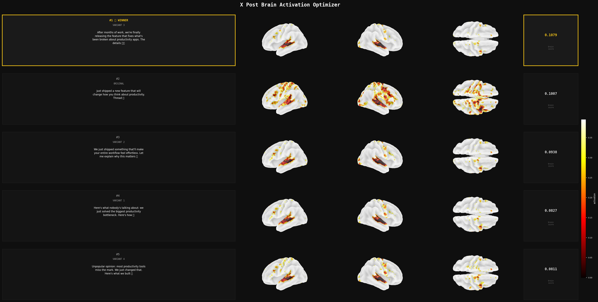

# X Post Brain Optimizer

> *Which version of your post lights up the human brain the most?*

This is an experiment built on top of [TRIBE v2](https://github.com/facebookresearch/tribev2) — Meta's foundation model for predicting fMRI brain responses to naturalistic stimuli. Instead of using it for neuroscience research, we use it to rank X (Twitter) post variants by the cortical activation they predict.

The hypothesis: **a post that triggers stronger, broader brain activity might be more engaging.**



*Real output: 5 variants of the same post, ranked by predicted cortical activation. The winner (gold) scored 0.1079; each row shows left, right, and top-down views of the predicted brain response.*

---

## How it works

```
Your post
    │
    ▼
Claude (via OpenRouter) generates N variants
    │
    ▼
Each variant → TRIBE v2 → predicted fMRI across 20,484 brain vertices
    │
    ▼
Score = mean absolute cortical activation
    │
    ▼
Winner + visualization
```

1. **Text → Speech → Transcript** — TRIBE v2 converts your text to speech, transcribes it back to get word-level timings, then feeds it through Llama-3.2-3B to extract contextual embeddings
2. **Brain prediction** — a multimodal Transformer maps those embeddings onto the fsaverage5 cortical surface (~20k vertices), outputting predicted BOLD signal per timestep
3. **Scoring** — we average over time and take the mean absolute activation as a single scalar
4. **Visualization** — every variant gets rendered side-by-side with its brain map

---

## Files

| File | Description |
|------|-------------|
| `optimizer.py` | Terminal version — prints ranked variants with scores |
| `visualize.py` | Full visual output — generates `brain_optimizer.png` |

---

## Setup (GPU required)

Needs a CUDA GPU with ~12 GB VRAM (RTX 3060 works with 8-bit quantization).

```bash
# 1. Install TRIBE v2 deps (from repo root)
pip install -e ".[plotting]"
pip install bitsandbytes accelerate "transformers==4.47.1" "exca==0.5.20"

# 2. Log in to HuggingFace (needed for Llama-3.2-3B access)
huggingface-cli login

# 3. Set your OpenRouter token in the script
# Edit OPENROUTER_TOKEN = "YOUR_TOKEN_HERE" in visualize.py

# 4. Run
python "my version/visualize.py"
```

Get an OpenRouter token at [openrouter.ai/settings/keys](https://openrouter.ai/settings/keys).  
Get Llama access at [huggingface.co/meta-llama/Llama-3.2-3B](https://huggingface.co/meta-llama/Llama-3.2-3B) (auto-approved).

---

## Output

`visualize.py` produces [`brain_optimizer.png`](brain_optimizer.png) (shown at the top) — a dark-themed panel showing every variant ranked by brain score. Each row contains:

- the post text
- left / right / top-down views of the predicted cortical activation
- the brain score (mean absolute activation)

The winner gets a gold border 👑, and the color scale is shared across all brains so activations are directly comparable.

`brain.png` and `brain_2.png` are single-post brain maps from earlier runs.

---

## Caveats

- **This is an experiment, not a proven method.** There's no peer-reviewed evidence that higher fMRI prediction scores correlate with social media engagement.
- TRIBE v2 was trained to predict responses in a specific set of subjects watching naturalistic video/audio/text stimuli — using it on tweet-length text is out-of-distribution.
- The 8-bit quantization slightly degrades Llama's representations vs. the original float16 setup Meta used.
- Short text (< 2 sentences) produces very few timesteps, making scores less stable.

That said brain visualizations are cool.

---

## Based on

- **TRIBE v2** — [paper](https://ai.meta.com/research/publications/a-foundation-model-of-vision-audition-and-language-for-in-silico-neuroscience/) · [weights](https://huggingface.co/facebook/tribev2) · [repo](https://github.com/facebookresearch/tribev2)
- **Llama 3.2-3B** — text feature extractor backbone
- **OpenRouter** — LLM variant generation
